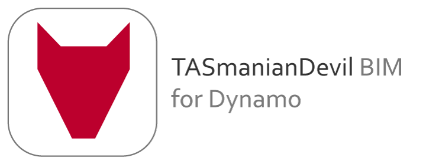

TASmanianDevil BIM is a free and open source plugin for Dynamo to help engineers and designers using TAS to perform thermal and daylight simulation.

[TASmanianDevil BIM introduction video.](https://youtu.be/Y6bUv8GEwXU)

[TASmanianDevil BIM videos.](https://www.youtube.com/playlist?list=PLoHg9rXwbHvzEEoRiCwfKTUYzuL14ZtNq)

In order to use TASmanianDevil you need to install TAS by EDSL [Download] (http://www.edsl.net/main/Software/EngineeringDownloads.aspx)

Licence
========================================
TASmanianDevil: A Dynamo Plugin for Thermal Analysis (GPL) started by Michal Dengusiak and joined by Jakub Ziolkowski
 
Copyright (c) 2019, Michal Dengusiak

TASmanianDevil BIM is free software; you can redistribute it and/or modify it under the terms of the GNU General Public License as published by the Free Software Foundation; either version 3 of the License, or (at your option) any later version. 
 
TASmanianDevil BIM is distributed in the hope that it will be useful, but WITHOUT ANY WARRANTY; without even the implied warranty of MERCHANTABILITY or FITNESS FOR A PARTICULAR PURPOSE. See the GNU General Public License for more details.
 
You should have received a copy of the GNU General Public License along with TASmanianDevil; If not, see <http://www.gnu.org/licenses/>.
 
@license GPL-3.0+ <http://spdx.org/licenses/GPL-3.0+>

Useful links
========================================
[Facebook page for TASmanianDevil BIM](https://www.facebook.com/TASmanianDevilBIM)

[LinkedIN page ](https://www.linkedin.com/groups/3346567)
